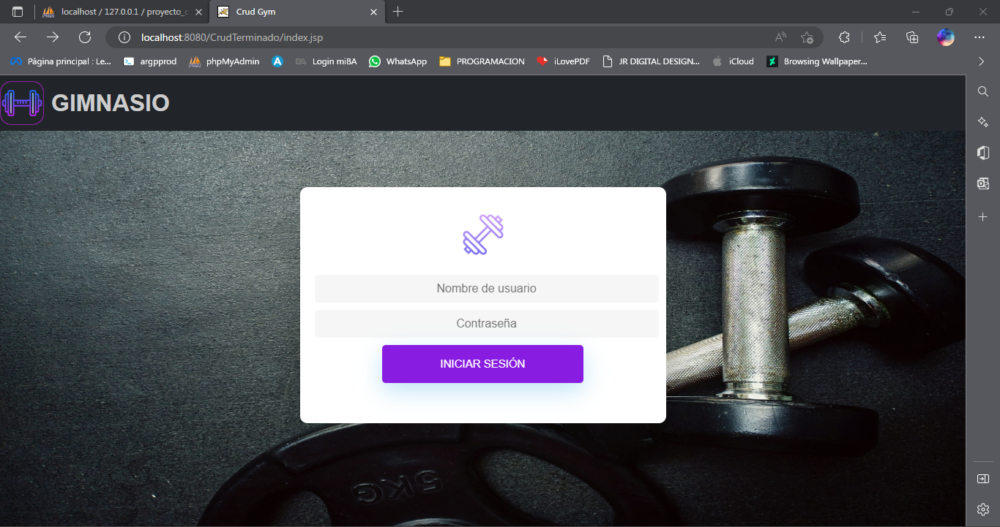
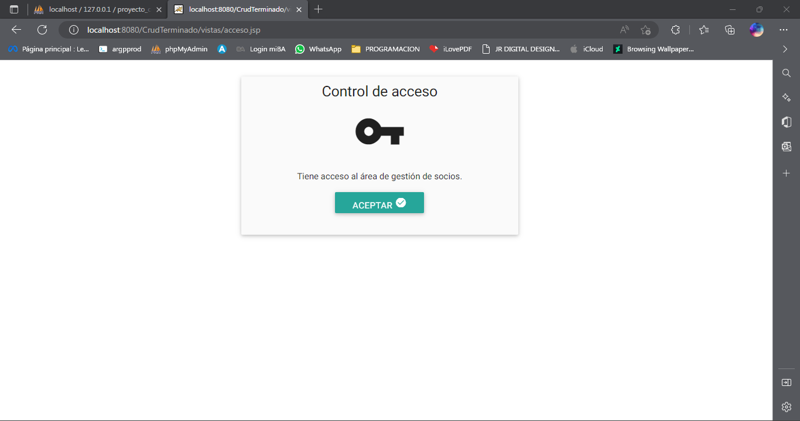
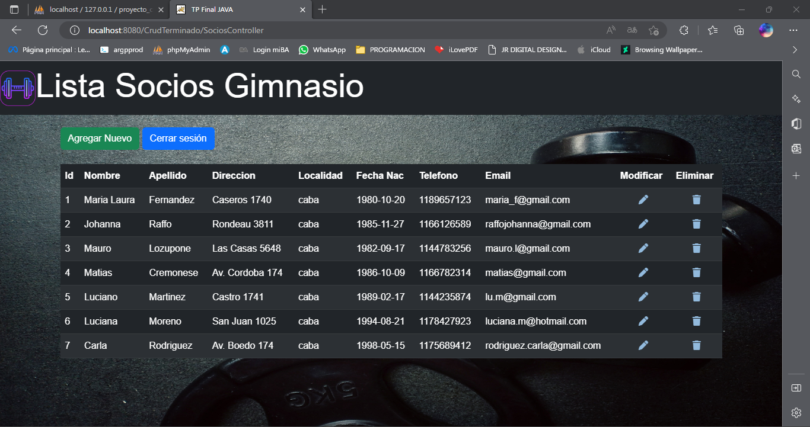
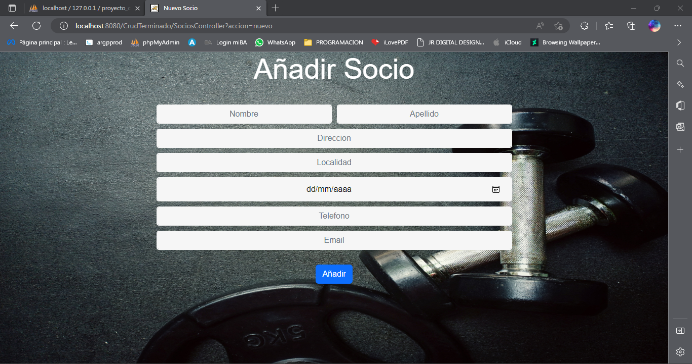
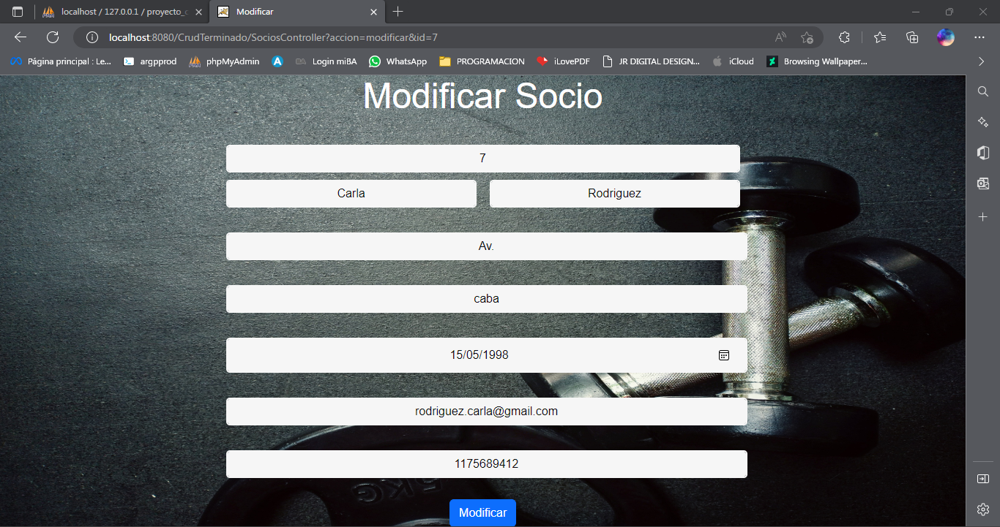

# CRUD JAVA: Socios Gimnasio       
Crud Creado como Trabajo Final para el Curso de JAVA de Codo a Codo.

## Partes del CRUD

Al entrar a la web se abrirá el index.jsp, el cual contiene login mediante usuario y contraseña. Para acceder al admin: 
Usuario = admin; 
Clave= 123456

> Acceso Admin

Al iniciar sesión con el usuario "admin" aparecerá la siguiente confirmación:
 
 
 
Luego de dar en aceptar nos llevará a la vista para administración de la aplicación, donde se pueden ver la lista de socios cargados en el sistema.

> Agregar Socios

En la parte superior encontraremos el botón para agregar una persona nueva, y cerrar sesión respectivamente.

En caso de querer agregar una persona nueva nos llevará a la siguiente vista.

> Modificar Socio

En el caso de querer modificar la persona podremos hacerlo mediante el lápiz de la lista de socios. Pulsandolo nos llevará a la siguiente vista.
Donde se encontrará los mismos campos que en agregar persona (con los datos ya existentes) para poder actualizar al socio correctamente.

Desde la lista de socios también podremos eliminar a cualquier persona mediante el botón trash.

## Base de Datos
La base de datos cuenta con dos tablas: una llamada "acceso" y otra "socios".
